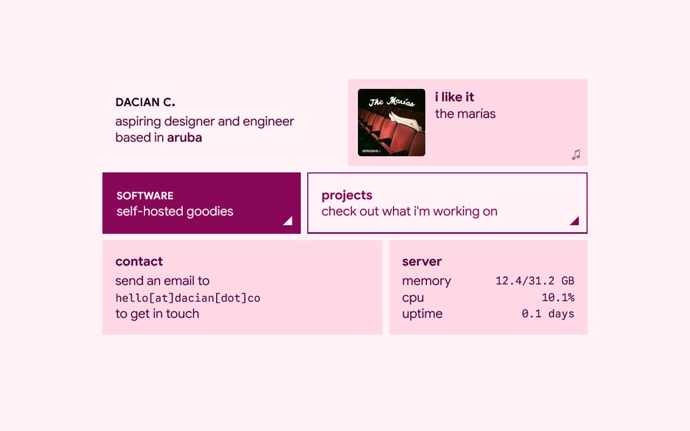
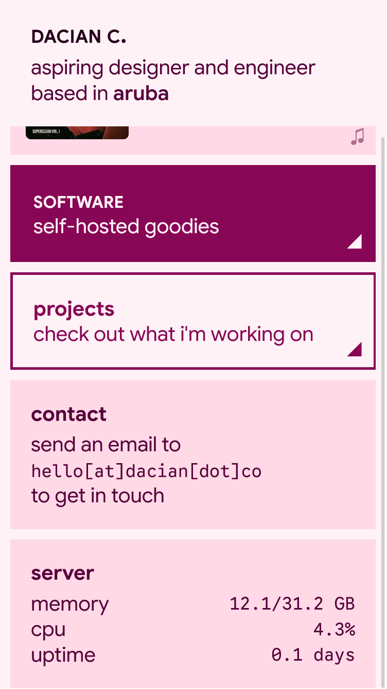

# [♡ dacian.co](https://dacian.co)
### Portfolio website built with Go, Gin and htmx
---
© 2026 Dacian C. - [MIT License](LICENSE)

## Preview
| Desktop | Mobile |
| ------- | ------ |
|  | 

## Technologies
### **[Go](https://go.dev)** - Open-source programming language supported by Google
### **[Gin](https://gin-gonic.com/)** - HTTP router and template rendering 
### **[htmx](https://htmx.org/)** - Partial page updates without writing Javascript

## Features
### Live Last.fm integration
Scrobbles (including currently playing!) are fetched directly from [Last.fm](https://last.fm). Define `LASTFM_USERNAME` and `LASTFM_API_KEY` in `.env`.
### Live server metrics
Server vitals are fetched with [`gopsutil`](https://github.com/shirou/gopsutil) and updated periodically via Goroutines. 
### Edit page content via json
The contents of pages can be changed in `data/cards.json`. Adding additional pages is possible but would require defining an HTTP handler in `main.go`.